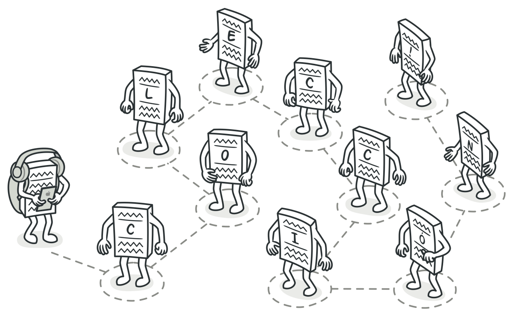
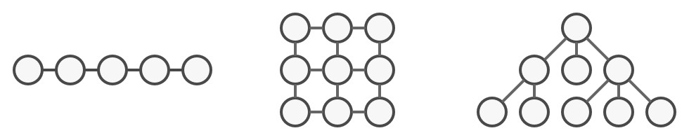
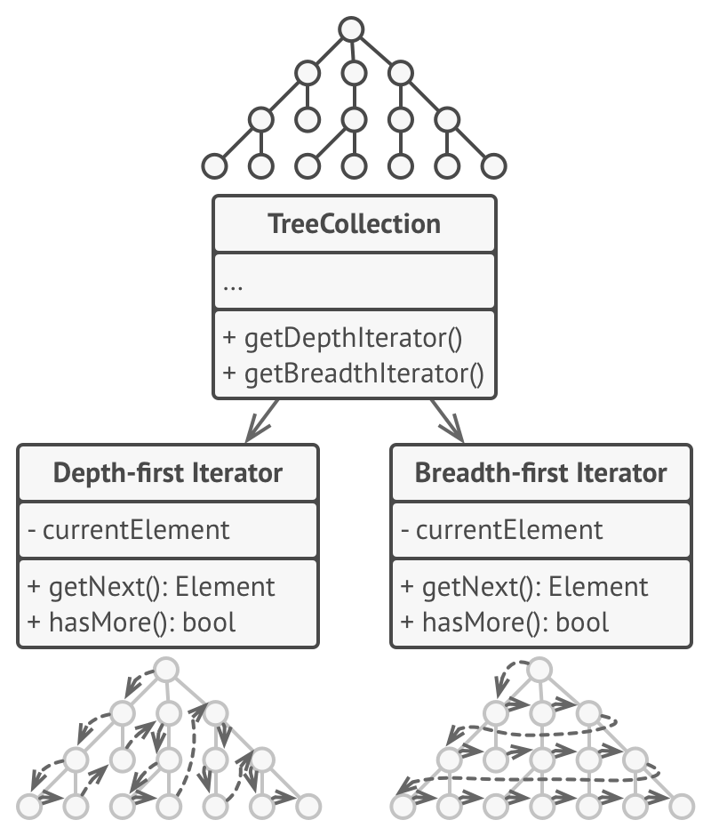
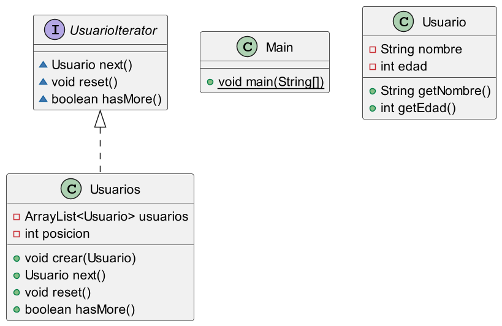

### Patrón de diseño Iterator

**Tipo: Patrón de comportamiento**

Permite recorrer secuencialmente los elementos de una colección sin exponer su implementación interna. Es especialmente útil cuando se necesita acceder a los elementos de una colección de manera uniforme, sin importar cómo estén almacenados (listas, conjuntos, árboles, etc.).

### Uso y Función

****El patrón Iterator se utiliza cuando:****

Se desea recorrer una colección de objetos de manera uniforme, sin necesidad de conocer su estructura interna.
Se necesita ofrecer múltiples formas de recorrido (por ejemplo, hacia adelante, hacia atrás).
Se desea encapsular la lógica de recorrido, delegando esta responsabilidad a un objeto iterador específico.
Beneficios
Desacoplamiento: Separa la lógica de recorrido de la colección en un objeto distinto.
Flexibilidad: Permite recorrer la colección de distintas maneras sin modificar su estructura.
Compatibilidad: Facilita la implementación de nuevas estructuras de datos sin afectar el código que las consume.
El patrón Iterator es esencial para diseñar sistemas que requieran iteraciones eficientes y consistentes sobre colecciones de objetos.

**Problema**

Las colecciones son de los tipos de datos más utilizados en programación. Sin embargo, una colección tan solo es un contenedor para un grupo de objetos.

Varios tipos de colecciones

La mayoría de las colecciones almacena sus elementos en simples listas, pero algunas de ellas se basan en pilas, árboles, grafos y otras estructuras complejas de datos.

**Solución**

La idea central del patrón Iterator es extraer el comportamiento de recorrido de una colección y colocarlo en un objeto independiente llamado iterador.

Los iteradores implementan varios algoritmos de recorrido. Varios objetos iteradores pueden recorrer la misma colección al mismo tiempo.

**Aplicabilidad**

Utiliza el patrón Iterator cuando tu colección tenga una estructura de datos compleja a nivel interno, pero quieras ocultar su complejidad a los clientes (ya sea por conveniencia o por razones de seguridad).

**Pros y contras**

Principio de responsabilidad única.
Puedes limpiar el código cliente y las colecciones extrayendo algoritmos de recorrido voluminosos y colocándolos en clases independientes.

Principio de abierto/cerrado. Puedes implementar nuevos tipos de colecciones e iteradores y pasarlos al código existente sin descomponer nada.

Puedes recorrer la misma colección en paralelo porque cada objeto iterador contiene su propio estado de iteración.

Por la misma razón, puedes retrasar una iteración y continuar cuando sea necesario.

Aplicar el patrón puede resultar excesivo si tu aplicación funciona únicamente con colecciones sencillas.

Utilizar un iterador puede ser menos eficiente que recorrer directamente los elementos de algunas colecciones especializadas.

**Relaciones con otros patrones**

Puedes utilizar Iteradores para recorrer árboles Composite.

Puedes utilizar el patrón Factory Method junto con el Iterator para permitir que las subclases de la colección devuelvan distintos tipos de iteradores que sean compatibles con las colecciones.

Puedes usar Memento junto con Iterator para capturar el estado de la iteración actual y reanudarla si fuera necesario.

Puedes utilizar Visitor junto con Iterator para recorrer una estructura de datos compleja y ejecutar alguna operación sobre sus elementos, incluso aunque todos tengan clases distintas.

Fuente: https://refactoring.guru/es/design-patterns/iterator

Diagrama PlantUml del proyecto actual:

